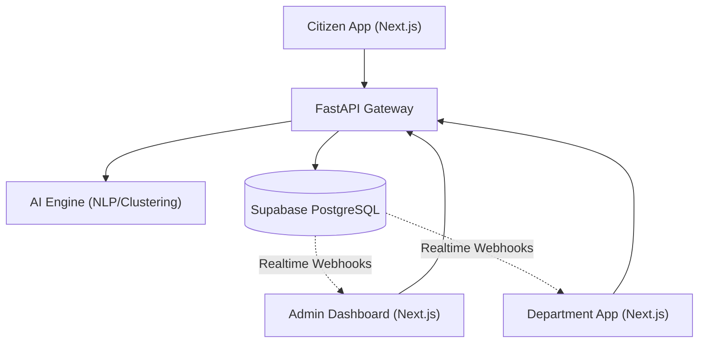

# CivicSense AI
**AI-Powered Public Grievance Intelligence Platform**

CivicSense AI is a next-generation Smart City Governance System that leverages Artificial Intelligence to automatically categorize, route, and analyze civic complaints in real-time. It provides distinct web portals for Citizens, City Departments, and Central Administrators, enabling complete transparency and eliminating duplicate efforts.

## Features

- **AI Complaint Classification**: Uses advanced Natural Language Processing to automatically predict the correct department and priority level from unstructured citizen descriptions.
- **Duplicate Detection**: Calculates text-embedding cosine similarities to catch duplicate issues across wards in real-time.
- **Ward Hotspot Analysis**: Evaluates high-velocity localized reports to predict failing infrastructure clusters.
- **Department Workflow Automation**: Connects assigned officers to a portal to review and update work orders directly.
- **Admin Intelligence Dashboards**: Real-time cross-department analytics using active Websocket connections.
- **Citizen Transparency**: Visual timeline of resolution progress for high-trust governance.
- **Role-Based OTP Authentication**: Secure login flows specifically divided among Admin, Department, and Citizens utilizing PyJWT.

## Architecture

This project is structured specifically with decoupled components suitable for high-scale environments.



### Tech Stack
- **Frontend**: Next.js App Router, TailwindCSS, Shadcn UI, Recharts, Lucide Icons
- **Backend**: Python FastAPI, SlowAPI (Rate Limiting)
- **Database / Auth**: Supabase PostgreSQL, PyJWT, Realtime WebSockets
- **AI / ML**: `sentence-transformers` (all-MiniLM-L6-v2), `scikit-learn` (K-Means Clustering, TF-IDF)

---

## Setup Instructions

**1. Clone the repository**
```bash
git clone <repository_url>
cd civicsense-ai
```

**2. Backend Setup (FastAPI + AI Engine)**
```bash
cd backend
python -m venv venv
source venv/bin/activate  # On Windows: venv\Scripts\activate
pip install -r requirements.txt
```
*Note: Create a `.env` file inside `/backend` with `SUPABASE_URL` and `SUPABASE_KEY`.*

```bash
# Start the Backend Server
python run.py
```
*Server will be available at http://localhost:8000*

**3. Frontend Setup (Next.js React)**
Open a new terminal session.
```bash
cd frontend
npm install
npm run dev
```
*Platform will be available at http://localhost:3000*

**4. Demo Data Seeding**
If you are running this project for demonstration purposes, execute the seeding script to populate the backend with intelligent mock data bypassing empty dashboards.
```bash
python scripts/seed_demo_data.py
```

---

## Recommended Demo Flow

When presenting this application, it is recommended to follow this chronological narrative:

**Step 1: The Citizen Experience**
1. Login as a citizen via OTP.
2. Submit a complaint (e.g., "Garbage piling up near bus stop").
3. Point out how the **AI Engine** automatically detects `Department: Sanitation` and `Priority: Medium`.
4. Demonstrate the visual timeline view.

**Step 2: Department Execution**
1. Login to the Department Dashboard as a Sanitation Officer.
2. Find the exact complaint instantly pushed via **Realtime WebSockets**.
3. Update the status to "Work Started".

**Step 3: Admin Intelligence**
1. Login to the central Admin Dashboard.
2. View the **Ward Hotspot Map** demonstrating spatial analysis.
3. Access **AI Insights** to show predictive metrics grouping the new inputs computationally. 

---
_Architected for Hackathons & Future Smart Cities._
